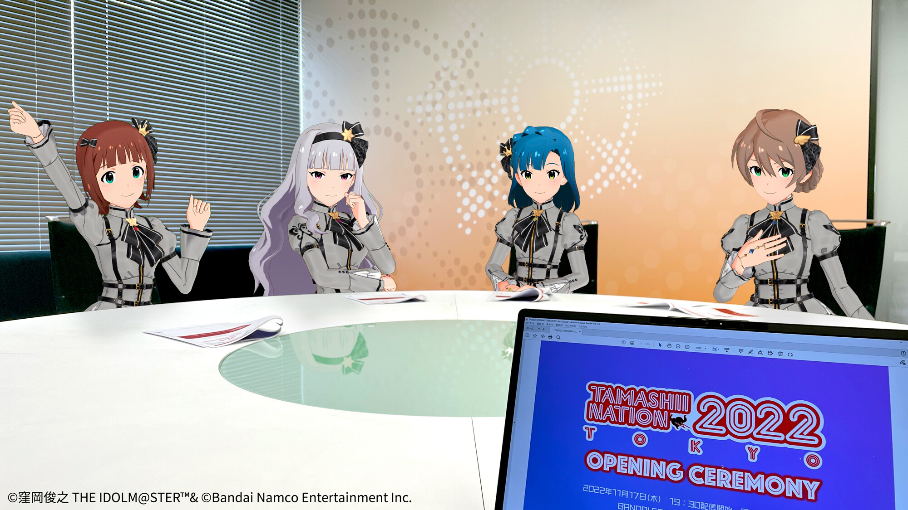

# アイマスニュースデザインテンプレート（非公式）
<a href="https://github.com/Apple-Yuki/imas/blob/main/LICENSE"></a>


### DEMO
demo:https://apple-yuki.github.io/imas/

### HOW TO USE
  
  include css
```  
  
  <link rel="stylesheet" href="https://apple-yuki.github.io/imas/all.css">

```


```

<div class="msgbox">
    <div class="msgboxtop">BLOG</div>
    <div class="msgboxbody">
        <h3>ブランドアンバサダーブログ</h3>
        
        
        <p>♪Vol.8♪ #765プロダクション 所属　#桜守歌織<br>
            今回は、11/17開催の「オープニングセレモニー」へ向けた打ち合わせの様子をご紹介します♪</p>
    </div>
    <div　class="msgboxfoot">
    <a></a>
    </div>
</div>
```

©窪岡俊之 THE IDOLM@STER™& ©Bandai Namco Entertainment Inc.  
©Bandai Namco Entertainment Inc.
